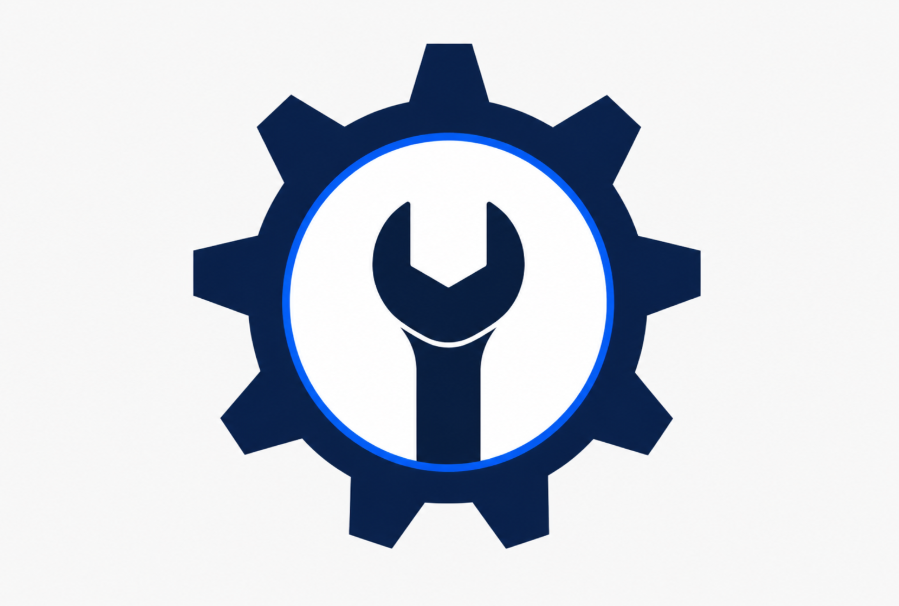

<div align="center">



# OperaCore CMMS

### Sistema de Gestión de Mantenimiento de Maquinaria Industrial

<p>
  
  
  
  
  
</p>

<p>
  
  
</p>

</div>

---

## 📋 Acerca del proyecto

**OperaCore CMMS** es un sistema web (*Computerized Maintenance Management System*) para **centralizar y digitalizar la gestión del mantenimiento industrial** de una planta de manufactura electrónica (EMS) dedicada al ensamble de **memorias RAM DDR5, Motherboards y SSDs NVMe M.2** mediante procesos SMT.

El objetivo es **reducir los paros de línea no planificados**, mejorar la **disponibilidad operativa** de la maquinaria y dar trazabilidad completa al trabajo de mantenimiento.

---

## ✨ Funcionalidades principales

<table>
<tr>
<td width="50%" valign="top">

### 🔧 Mantenimiento
- Registro y administración de maquinaria
- Mantenimientos preventivos y correctivos
- Calendario de actividades programadas
- Checklists digitales

</td>
<td width="50%" valign="top">

### 📊 Indicadores de confiabilidad
- **MTBF** — Tiempo medio entre fallas
- **MTTR** — Tiempo medio de reparación
- Disponibilidad operativa por línea
- Dashboards para gerencia y supervisores

</td>
</tr>
<tr>
<td width="50%" valign="top">

### ⚠️ Gestión de fallas
- Registro de incidencias con nivel de severidad
- Evidencias fotográficas
- Trazabilidad de fallas recurrentes
- Reportes técnicos

</td>
<td width="50%" valign="top">

### 📦 Inventario
- Control de refacciones y herramientas
- Registro de entradas y salidas
- Alertas de stock mínimo
- Notificaciones automáticas

</td>
</tr>
</table>

---


## 🏗️ Tecnologías

<div align="center">

| Capa | Tecnología |
|:---:|:---:|
| 🎨 **Frontend** | HTML5 + CSS + Django templates |
| ⚙️ **Backend / API** | Python + Django + Django REST Framework |
| 🗄️ **Base de datos** | MySQL |

</div>

---

## 🧩 Arquitectura del proyecto

Igual que en clase: **dos proyectos Django separados que se comunican por HTTP**,
no uno solo con todo mezclado.

```
Usuario → client (Django + templates) → requests.get/post → api (Django REST Framework) → MySQL
```

- **`api/`** — el "demo" de las clases. Expone datos con Django REST Framework.
  Cada módulo (`usuarios`, `maquinaria`, `mantenimiento`, `fallas`, `inventario`,
  `indicadores`) vive en `api/apps/<modulo>/` con sus `models.py`,
  `serializers.py`, `views.py` (APIView / generics) y `urls.py`. No sirve HTML.
- **`client/`** — el "client" de las clases. Es un Django normal con templates,
  pero **no toca la base de datos directo**: usa la librería `requests` para
  llamarle al `api/` (`client/apps/<modulo>/views.py`) y renderiza el HTML con
  esa respuesta.
- **`backend/`** — tus scripts SQL sueltos (triggers, cargas), no se ejecutan
  con `migrate`, son de apoyo manual contra MySQL.
- **`docs/mockups/`** — tus HTML de prueba, fuera de `templates/` a propósito
  para que Django no los cargue como si fueran vistas reales.

### Cómo correr ambos proyectos

Necesitas **dos terminales** (uno por proyecto), cada uno con su propio venv:

```bash
# Terminal 1 — api
cd api
python -m venv venv && source venv/bin/activate
pip install -r requirements.txt
cp .env.example .env        # pon DB_ENGINE=sqlite3 si no quieres MySQL todavía
python manage.py migrate
python manage.py runserver 8000

# Terminal 2 — client
cd client
python -m venv venv && source venv/bin/activate
pip install -r requirements.txt
cp .env.example .env        # API_BASE_URL debe apuntar al puerto del api (8000)
python manage.py migrate
python manage.py runserver 8001
```

Abre `http://localhost:8001/` — cada módulo del client ya está jalando su
endpoint `ping/` del api para confirmar la conexión. De ahí sigues el patrón
de tu maestro: agregas campos a los modelos en `api/`, creas sus serializers
y vistas DRF, y del lado `client/` agregas las vistas que consuman esos
endpoints con `requests`.

---

## 👥 Equipo de desarrollo

<div align="center">

| Integrante | Rol |
|---|---|
| **Urquidez Arredondo Misael** | 🧭 Líder de Proyecto y Arquitecto de Software |
| **Gallardo Ramirez Luis David** | 💻 Desarrollador Full-Stack |
| **Huape Gil Josue Isaac** | 💻 Desarrollador Full-Stack |
| **Marquez Gomez Saul** | 💻 Desarrollador Full-Stack |
| **Zuñiga Arevalo Fernando Alonso** | 💻 Desarrollador Full-Stack |

</div>

<div align="center">

**📍 Universidad Tecnológica de Tijuana**
TSU Desarrollo de Software Multiplataforma · Proyecto Integrador

</div>

---

<div align="center">

### 🏭 Optimizando la disponibilidad operativa de líneas de ensamble SMT

</div>